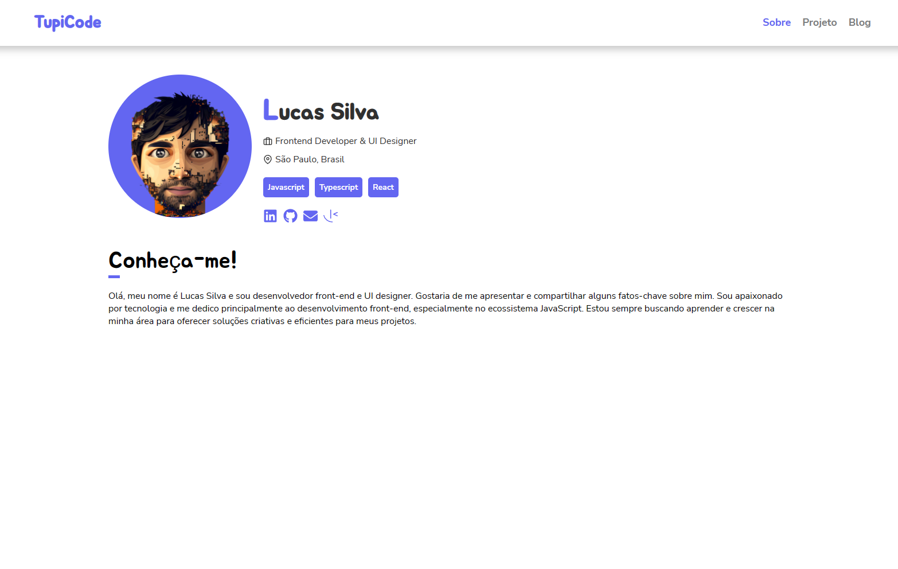

<h1 align="center">
Portfólio Lucas silva 💾
</h1>



<h4 align="center"><a href="https://www.tupicode.tech/">Clique para visitar o projeto</a></h4>

## 🛠️ Instalação do Frontend

Clone este repositório usando o comando

```
git clone https://github.com/Lucassocorrosilva7/Portfolio-Tupi.git
```

Entrar na pasta utilizando o comando:

```
cd Portfolio-Tupi-main
```

Próximo passo, execute o seguinte comando para instalações de pacotes:

```
npm install
# ou
yarn install
```

Próximo passo, execute o servidor de desenvolvimento:

```
npm run dev
# ou
yarn dev
```

## 💻 - Seções

- Início
- Projetos
- Blog

## ⚡ - Tecnologias utilizadas

- React.js;
- React-icons;
- Sass;
- BEM;
- Vercel;
- Hostinger;

## 👤 Autor

#### Feito por Lucas Silva. Entre em contato! 👇

<a href="https://www.linkedin.com/in/luquinhasssilva/"></a>
<a href="mailto:someone@lucassocorrosilva@gmail.com"></a>
